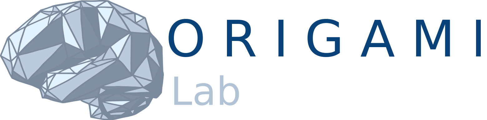

# QLSC 612 - Fundamentals for Neuro Data Science

* [Link to the **pre-recorded lectures and class material**.](./lectures-materials.html)
* [Link to the **live tutorial schedule**.](./tut-schedule.html)
* [Link to **setup instructions**](./setup.html).
* [Link to the **code of conduct**.](./coc.html)

## Course overview:

Neuroscientists increasingly rely on openly-accessible data and on advanced methodological procedures for their investigations. Data science offers a key set of tools and methods to efficiently analyse, visualize, and interpret neuroscience data. Concurrently, there is a growing concern in the life sciences that many results produced are difficult or even impossible to reproduce, commonly referred to as the “reproducibility crisis.”

This course — QLSC-612, [Fundamentals for Neuro Data Science](https://www.mcgill.ca/study/2019-2020/courses/qlsc-612) — brings together software and analytical tools and methods in order to teach students how to best use the fundamentals of data science in their daily work to produce reproducible results. We will take examples in neuroimaging and see how to use computational tools, statistical and machine learning techniques, and collaborative, open science methodologies to generate results that are statistically robust and computationally reproducible. The course also serves as the first week of the [Montreal BrainHack School](https://school.brainhackmtl.org/) organized across Université de Montréal, McGill, Concordia and Polytechnique. The course builds on the [ReproNim](https://www.repronim.org/) materials for reproducible neuroimaging research.

## Objective, scope, and intended audience

QLSC-612 is intended for researchers in the life sciences (neurologists, psychiatrists, pyschologists, neuroscientists) who wish to improve their research practices, or other researchers who want an introduction to data science with examples in neuroscience and neuroimaging. At the end of the course students will be able to analyze neuroscience and neuroimaging data in a reproducible and collaborative manner using the Python software stack (a popular and rapidly growing contender in the landscape of neuroscience data analysis).

Amongst the topics, we will cover both the fundamentals of tools (bash, git, github, jupyter, docker, visualization) and analysis methods (hypothesis testing, machine learning) at the conceptual and practical levels. See objectives of each module [here](./lectures-materials.html).

In terms of requirements, students will be expected to have basic programming skills (such as minimal experience in a scripting language).

## Course modules:

1. Introduction to Reproducibility
2. Terminal and Bash
3. Introduction to Python
4. Python Toolbox for Data Analysis
5. Git GitHub
6. Data Preprocessing in Python
7. Machine Learning 1: Supervised Learning
8. Machine Learning 2: Model selection & validation
9. Introduction to Data Visualization
10. Containers
11. High Performance Computing

[Link to the pre-recorded lectures and class material.](./lectures-materials.html)

## Approach to teaching

This year, we will be returning to in-person learning! Students taking the course for credit will have to attend lectures in room 189 (QLS Conference Room) of 550 Sherbrooke Street E. Students will be required to attend in-person lectures for all of the modules and will have access to [pre-recorded lectures and online content](https://neurodatascience.github.io/QLS612-Overview/lectures-materials.html) to better consolidate the material. Course grading will be based on the results of 2 in-person quizzes (see [schedule](https://neurodatascience.github.io/QLS612-Overview/tut-schedule.html)). The course requires that you have a laptop and instructions for installation are [here](https://neurodatascience.github.io/QLS612-Overview/setup.html). 

## Acknowledgements and funders
We are grateful for support from HBHL NeuroHub and the NIH funded ReproNim centre.  
